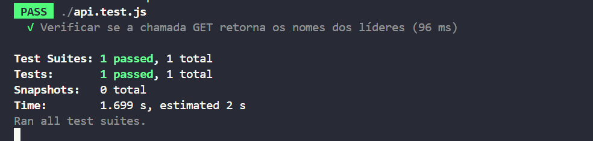

# ponderadaCasoDeTeste

# Caso de Teste 1 - Líderes - GET:
Nesse caso de teste, o Controller em análise é o de Líderes. Esse, tem a função de guardar todos os líderes associados a uma respectiva ONG do nosso sistema.
# Descrição:
Dessa forma, o tópico será composto por um teste associado à requisição de todos os Líderes representados a uma respectiva ONG.
# Propósito:
O objetivo desse teste é validar a requisição GET no Endpoint de Líderes de uma respectiva ONG. Sendo assim, o sucesso dessa operação deve exibir uma lista com todos os Líderes associados a uma ONG.
# Pré-condição:
Para a execução desse teste, algumas pré-condições foram estabelecidas:
- Estar conectado à plataforma integrada ao Backend;
- Existir alguma ONG criada e integrada ao banco de dados;
- Existir algum Líder criado e associado à alguma ONG no banco de dados.
# Procedimento de teste:
- Para o procedimento desse teste, o Script de teste precisar estar configurado para fazer uma chamada GET ao Endpoint responsável pelos Líderes;
- Executar a solicitação GET.
- Executar no terminal os seguintes comandos:
    - cd backend
    - npm i
    - npm run dev
# Resultados Esperados:
Os resultados esperados pela solicitação GET consiste em uma Array com o nome de todos os Líderes associados à uma respectiva ONG.
# Resultado obtido:
O resultado da requisição GET foi concluída com sucesso.

<div>
    
</div>

# Resultados que podem dar erro e exemplificá-los:
Um resultado que pode dar erro  é quando ocorrer uma falha com a conexão do servidor. Sendo assim, o teste não poderá ser conclúido corretamente.
# Pós-condição:
Todos os líderes cadastrados no banco de dados foram recuperados com sucesso através da operação de busca "get all". A lista resultante contém todos os líderes ativos e inativos, refletindo a totalidade dos registros presentes na base de dados.

# Código:
```
const axios = require('axios');

test('Verificar se a chamada GET retorna os nomes dos líderes', async () => {
  const response = await axios.get('http://localhost:3000/leaders');
  expect(response.status).toBe(200);
  expect(response.data).toBeDefined();
  expect(response.data.leaders).toBeDefined();
  expect(Array.isArray(response.data.leaders)).toBe(true);
  expect(response.data.leaders.length).toBeGreaterThan(0);
  response.data.leaders.forEach(leader => {
    expect(leader.name).toBeDefined();
    expect(typeof leader.name).toBe('string');
  });
});
```
# Pequena Conclusão:
Ao realizar o teste de busca de todos os líderes no banco de dados, verificou-se que a funcionalidade "get all" operou conforme o esperado, retornando todos os líderes registrados. Isso confirma a integridade e a eficácia da operação de recuperação de dados em relação aos líderes, garantindo assim a consistência e a confiabilidade do sistema em lidar com essa funcionalidade.
